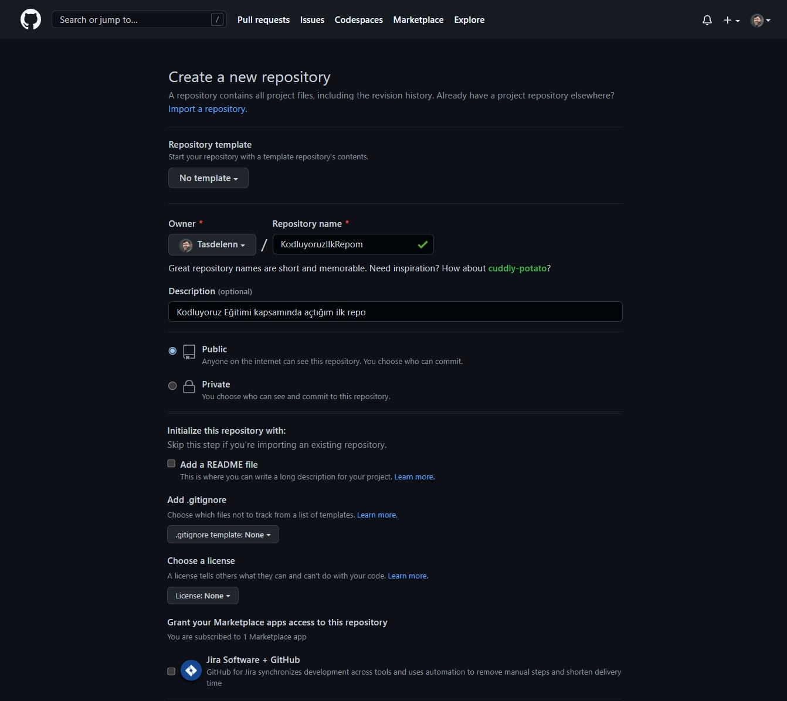

# kodluyoruzilkrepo
Bu repo [Kodluyoruz](https://app.patika.dev/courses/frontend-web-gelistirme) Front-End Eğitiminde oluşturduğumuz ilk repo. İçerisinde bir adet README dosyası, bir adet de index.html barındırıyor.



## Installation
Öncelikle projeyi "clone"layın (Buraya sizin reponuzdan aldığınız link gelecek).
```https://github.com/Tasdelenn/kodluyoruzilkrepo.git```

## Usage
Projeyi clone'ladıktan sonra Visual Studio Code, IntelliJ, Eclipse vb. IDE programında açınız.
Linux'ta Visual Studio Code ile açmak için:
```
cd kodluyoruzilkrepo
code .
```
## Contributing
Pull requestler kabul edilir. Büyük değişiklikler söz konusuysa, lütfen önce neyi değiştirmek istediğinizi tartışmak için bir konu açınız.

## Licence
[MIT Licence](https://mit-license.org/)

